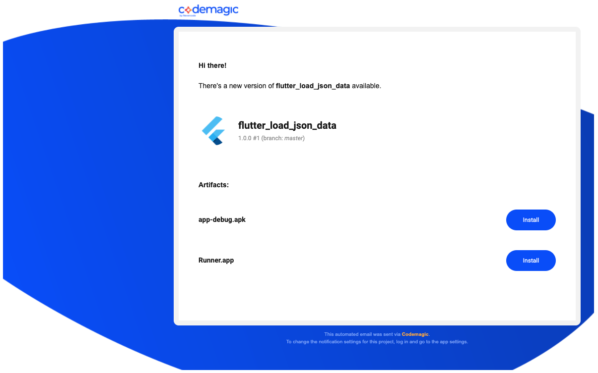

# flutter_load_json_from_local

A new Flutter project.

## Getting Started
- git clone 'https://github.com/cybriz/flutter_load_json_data/tree/master' flutter_todo_list
- flutter create --androidx .If android or ios folders aren't present.
- flutter packages get or flutter pub get
- flutter run

## Install demo app into your own phone
APK(android): https://drive.google.com/file/d/1DgGdxzwVNmfIT6Qp3-hr3ZTFxcKgAXud/view?usp=sharing

RUNNER(ios): https://drive.google.com/file/d/1xHlZs7_KNArq9veXnIr5HBTuyKZx-ppY/view?usp=sharing

- Download the apk using phone default Package Installer.
- Tap the 'apk' file for android and 'runner' file for ios.
- Click 'install' and then 'install anyway'.
- Click 'Done' or 'Open' to proceed.

## Screenshots
- Uses Codemagic CI/CD
